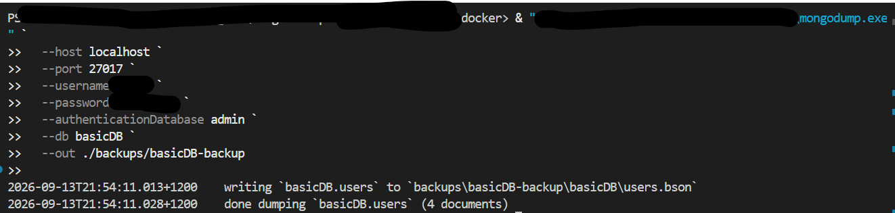
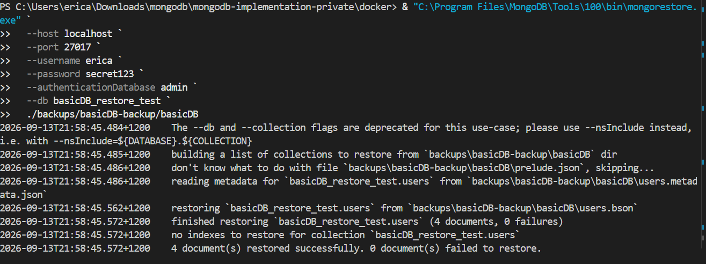
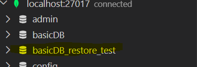

Need to ensure you have the mongo database tools downlaodedl https://www.mongodb.com/try/download/database-tools

### Logical backup (mongodump)
``
mongodump --db basicDB --out ./backups/basicDB-backup
``

### Logical restore (mongorestore)
``
mongorestore --db basicDB ./backups/basicDB-backup/basicDB

``

Restoring to a database called 'basicDB_restore_test'

### Docker volume backup
Explain that your MongoDB container stores data in:

``
/data/db
``
#### How to snapshot the volume:

``
docker run --rm \
  -v mongodb:/data \
  -v $(pwd)/backups:/backup \
  alpine tar czvf /backup/mongo-volume.tar.gz /data
``

## MongoDB Maintenance & Backup Comparison (Ola Hallengren Equivalent)

### Overview
SQL Server DBAs often use Ola Hallengren’s maintenance solution for automated backups, index maintenance, integrity checks, and cleanup jobs. MongoDB does not have a direct community‑driven equivalent for its Community Edition. Instead, MongoDB provides similar functionality through Atlas or Ops Manager.

#### MongoDB Atlas (Closest Equivalent)
Atlas provides fully managed maintenance and backup automation:

- Automated snapshots
- Continuous cloud backups (Point‑in‑Time Restore)
- Automated restore workflows
- Automated scaling
- Index suggestions via Performance Advisor
- Monitoring dashboards
- Alerts and notifications
- Atlas is the closest match to Ola Hallengren because it removes the need for manual scripts.

##### MongoDB Ops Manager (Enterprise Equivalent)
Ops Manager is the on‑premise enterprise solution that provides:

- Continuous backups
- Point‑in‑time restore
- Automated maintenance
- Automated monitoring
- Deployment automation
- Index suggestions
- Performance dashboards
- Alerting

Ops Manager is the true Ola Hallengren equivalent for self‑hosted MongoDB, but it requires an enterprise license.

#### MongoDB Community Edition (Docker / Local)
MongoDB Community Edition does not include automated maintenance or backup scheduling. DBAs must implement these manually:

- mongodump / mongorestore
- Filesystem or Docker volume snapshots
- Cron or Task Scheduler scripts
- Manual index review (db.collection.getIndexes())
- Manual performance analysis (explain())
- Monitoring via mongostat, mongotop, serverStatus()

Community Edition requires custom scripting and manual DBA workflows.
